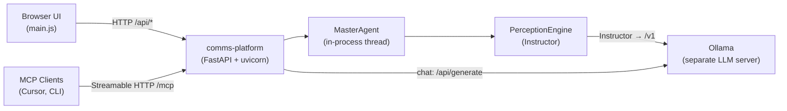

# ai-comms-platform

Under active development. 

This repository contains a communications platform with TTS, TTI, TT3D, and a master agent.  

Interop: with Unreal Engine, TouchDesigner, Ollama.  
Contains: Diffusers, XFormers, Triton, Instructor.  

- TTS model Supertonic 3
- TTI model SDXL-Base-1
- TT3D model [Hunyuan3D-2.1](https://huggingface.co/tencent/Hunyuan3D-2.1) (text → SDXL → shape → PBR texture → GLB)

Development Guidelines:

- A master agent controls and is accessed by the platform.
- Coordination is mandatory for critical environments.
- Expose API and execution timings.
- Local and field-first architecture

## Package layout

```
src/comms_platform/
├── main.py              # entry point
├── config.py
├── constants.py         # shared env defaults and paths
├── agent/               # master agent + perception engine
├── transport/           # EventBus, OSC gateway, thread manager
├── integrations/        # Ollama, TouchDesigner, Unreal orchestration
├── inference/           # TTS, TTI, and TT3D engines
├── utils/
├── mcp/                 # MCP server (Streamable HTTP)
└── web/
    ├── app.py           # FastAPI factory and lifespan
    ├── routes/          # HTTP route modules by domain
    ├── schemas.py
    └── static/          # dashboard UI (HTTP client)
```

## MCP control plane

The platform exposes a [Model Context Protocol](https://modelcontextprotocol.io) server alongside the existing REST API. MCP clients (Cursor, Claude Code, MCP Inspector) can start/stop the master agent, send natural-language messages, and read runtime state.



### MCP tools

| Tool | Description |
|------|-------------|
| `agent_start` | Start the master agent heartbeat loop |
| `agent_stop` | Stop the master agent heartbeat loop |
| `agent_status` | Return current agent runtime status |
| `agent_message` | Natural-language input via perception routing and optional Ollama chat |

### MCP resources

| URI | Description |
|-----|-------------|
| `platform://agent/state` | JSON snapshot of agent and connection runtime state |
| `platform://agent/intent` | JSON snapshot of the latest perception routing decision |

### Connect from Cursor

With the platform running (default `http://127.0.0.1:8000`):

```json
{
  "mcpServers": {
    "communications-platform": {
      "url": "http://127.0.0.1:8000/mcp"
    }
  }
}
```

Environment variables:

| Variable | Default | Description |
|----------|---------|-------------|
| `MCP_ENABLED` | `true` | Enable MCP Streamable HTTP mount |
| `MCP_MOUNT_PATH` | `/mcp` | HTTP mount path for the MCP endpoint |

## Reproduce Windows

Requires Python 3.12 on Windows for the CUDA PyTorch wheel set used by SDXL.

```sh
# First time
uv venv
uv pip install -r requirements.txt

.\run_platform.bat
```


## Blocks

<details>
<summary>Block 01 - Agent</summary>

- Starts and stops the master agent.
- Shows current agent state.
- Uses the top-left control block for core runtime control.
</details>

<details>
<summary>Block 02 - Terminal</summary>

- Shows backend logs, stream events, and agent replies.
- Acts as the main realtime output surface.
- Useful for tracing platform activity and request flow.
</details>

<details>
<summary>Block 03 - Agent State</summary>

- Displays a JSON snapshot of the current runtime state.
- Can be scoped to agent (includes stream, connections, inference), third party, or timers.
- Includes refresh and copy controls for debugging.
</details>

<details>
<summary>Block 04 - Engines</summary>

- Launches TouchDesigner example workflows.
- Checks TouchDesigner process state.
- Sends test data and UE5 bridge messages.
- Checks whether Ollama is reachable on the host.
- Opens Ollama from the installed Windows executable when available.
- Lets you pick an available Ollama model for agent chat.
</details>

<details>
<summary>Block 05 - Media Viewer</summary>

- Shows latest generated media artifacts.
- Image card: TTI thumbnail preview, image path, and Open Image action.
- Audio card: TTS audio player, audio path, and Open Audio action.
- Model card: TT3D GLB preview (model-viewer), model path, and Open Model action.
- Includes Refresh to reload latest media from backend endpoints.
</details>

<details>
<summary>Block 06 - Inference</summary>

- Hosts inference engine controls in a compact control surface.
- SuperTonic 3: load/unload TTS engine and monitor engine status.
- SDXL Base 1 (TTI): load/unload image pipeline and run quick generation checks. Uses xFormers attention when available for faster generation.
- Hunyuan3D 2.1 (TT3D): load/unload 3D pipeline and run one-shot text-to-3D generation. Requires vendor setup (see above).
</details>

<details>
<summary>Block 07 - Timers</summary>

- Interval timers for TTS, TTI, and TT3D test renders.
- TTS/TTI: every 10 seconds or every 20 seconds.
- TT3D: every 60 seconds or every 120 seconds (generation is slower).
- Timer state is tracked in the agent state `timers` section.
</details>

<details>
<summary>Block 08 - User Input</summary>

- Sends text payloads to the backend agent.
- Creates the main human-to-agent message path.
- Appends the user message and agent reply into the terminal view.
</details>


## API

Current API endpoints and capabilities:

- `GET /` — serves the web UI
- `GET /health` — liveness endpoint
- `GET /events` — SSE stream for frontend realtime events/logs
- `GET /api/status` — runtime status (SSE clients, OSC in/out, agent state)

- `POST /api/signals/publish` — publishes a stream signal to frontend/event bus
- `POST /api/signals/send` — sends signal (OSC when `protocol=osc`, otherwise stream)


- `POST /api/agent/start` — starts agent coordinator
- `POST /api/agent/stop` — stops agent coordinator
- `POST /api/agent/message` — sends human text to the agent, appends to history, and returns the current reply plus routing/LLM metadata

- `MCP /mcp` — Streamable HTTP MCP endpoint (tools: `agent_start`, `agent_stop`, `agent_status`, `agent_message`; resources: `platform://agent/state`, `platform://agent/intent`)

- `POST /api/unreal/event` — ingests Unreal events and toggles agent start/stop based on current state
- `POST /api/platform/send-to-unreal` — sends a message to Unreal `/notify`

- `GET /api/ollama/status` — checks Ollama availability and lists models
- `POST /api/ollama/open` — starts Ollama when installed locally

- `GET /api/tts/status` — reports whether SuperTonic 3 is loaded
- `POST /api/tts/engine/on` — loads SuperTonic 3 into memory for fast inference
- `POST /api/tts/engine/off` — unloads SuperTonic 3 from memory
- `POST /api/tts/synthesize` — synthesizes TTS audio using SuperTonic 3 and returns WAV audio
- `POST /api/tts/test` — runs a quick TTS render and stores latest audio artifact

- `GET /api/tti/status` — reports whether SDXL Base 1 (TTI) is loaded
- `POST /api/tti/engine/on` — loads SDXL Base 1 pipeline into memory
- `POST /api/tti/engine/off` — unloads SDXL Base 1 pipeline from memory
- `POST /api/tti/generate` — generates an image from prompt and returns preview payload + output file metadata
- `POST /api/tti/test` — runs a quick TTI render and stores latest image artifact

- `GET /api/tt3d/status` — reports whether Hunyuan3D 2.1 is loaded and prerequisite checks
- `POST /api/tt3d/engine/on` — loads Hunyuan3D shape (and paint, when enabled) pipelines
- `POST /api/tt3d/engine/off` — unloads TT3D pipelines and clears GPU cache
- `POST /api/tt3d/generate` — one-shot text-to-3D: SDXL reference → shape → optional PBR → GLB
- `POST /api/tt3d/test` — runs a quick TT3D render with the default test prompt

- `GET /api/media/tti/latest` — serves `output/tti_latest.png` for UI/media viewer
- `GET /api/media/tts/latest` — serves `output/tts_latest.wav` for UI/media viewer
- `GET /api/media/tt3d/latest` — serves `output/tt3d_latest.glb` for UI/media viewer


- `POST /api/touchdesigner/run-example` — launches `touchdesigner/example1.toe`
- `POST /api/touchdesigner/send-test-data` — sends JSON payload to TouchDesigner web server (`TD_WEB_HOST:TD_WEB_PORT`)
- `GET /api/touchdesigner/processes` — lists running TouchDesigner processes on this machine


## Tests

Run tests with `uv` from the project root:

```sh
# New Unreal trigger HTTP tests (without external Unreal/TD software)
uv run pytest -q tests/test_api_unreal_start_audio.py
uv run pytest -q tests/test_api_unreal_start_image.py

# Live HTTP tests (send real POST requests to running API, watch backend console logs)
# Terminal 1: start platform
.\run_platform.bat

# Terminal 2: send live trigger requests via pytest
uv run pytest -q -s tests/test_http_unreal_live.py

# Optional: use a non-default API host/port
LIVE_API_BASE_URL=http://127.0.0.1:8000 uv run pytest -q -s tests/test_http_unreal_live.py

# Optional: run all API tests
uv run pytest -q tests/test_api_*.py
```


## License

Licensed under the [MIT License](./LICENSE).
