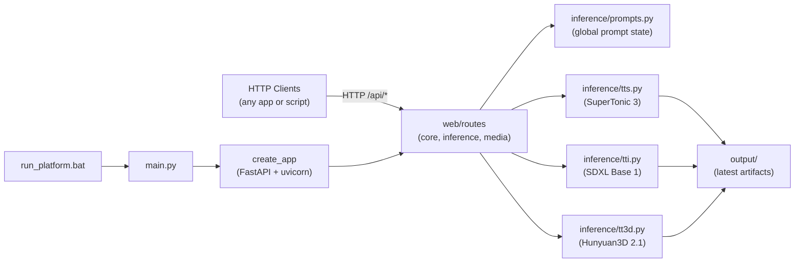

# ai-comms-platform

Headless **REST inference API** for multimodal generation on Windows. Any client — scripts, game engines, creative tools, mobile apps, or automation pipelines — can connect over HTTP; no bundled UI or host-specific integrations required.

- **TTS** — SuperTonic 3
- **TTI** — SDXL-Base-1
- **TT3D** — [Hunyuan3D-2.1](https://huggingface.co/tencent/Hunyuan3D-2.1) (text → SDXL → shape → PBR texture → GLB)

Stack: FastAPI, Diffusers, xFormers, Triton (Windows), PyTorch CUDA.

## Architecture



The server exposes a stable HTTP surface. Clients poll status, trigger generation, and fetch artifacts from `/api/media/*` — integration is entirely up to the consumer.

## Package layout

```
src/comms_platform/
├── main.py              # entry point
├── config.py            # host/port and startup options
├── constants.py         # model defaults and output paths
├── inference/           # TTS, TTI, TT3D engines + startup preload
├── utils/
└── web/
    ├── app.py           # FastAPI factory and lifespan
    ├── routes/          # HTTP route modules
    └── schemas.py       # request payloads
```

## Quick start (Windows)

Requires Python 3.12 for the CUDA PyTorch wheels used by SDXL.

```sh
uv venv
uv pip install -r requirements.txt
uv pip install -e .

.\run_platform.bat
```

Default base URL: `http://127.0.0.1:8000`

`run_platform.bat` installs CUDA PyTorch, xFormers, triton-windows, applies Hunyuan3D vendor patches, and starts the API. On startup it preloads **TTS**, **TTI**, and **TT3D** so all three pipelines are ready before the first request.

| Variable | Default | Description |
|----------|---------|-------------|
| `WEB_HOST` | `127.0.0.1` | Bind address |
| `WEB_PORT` | `8000` | Bind port |
| `ENGINES_PRELOAD_ON_STARTUP` | `true` | Load all engines at startup |
| `ENGINES_PRELOAD_ON_STARTUP=false` | — | Skip preload; use `/api/*/engine/on` instead |

One-time Hunyuan3D vendor clone (required for TT3D):

```powershell
.\scripts\setup_hunyuan3d.ps1
```

## Example client flow

```sh
# Health check
curl http://127.0.0.1:8000/health

# Set a shared prompt for test endpoints
curl -X POST http://127.0.0.1:8000/api/inference/prompt \
  -H "Content-Type: application/json" \
  -d '{"prompt": "a neon cyberpunk city at night"}'

# Generate an image (engine must be loaded)
curl -X POST http://127.0.0.1:8000/api/tti/generate \
  -H "Content-Type: application/json" \
  -d '{"prompt": "a neon cyberpunk city at night"}'

# Fetch latest artifact
curl -O http://127.0.0.1:8000/api/media/tti/latest
```

Each generate endpoint also accepts its own `text` or `prompt` field directly.

## API reference

### Core

| Method | Path | Description |
|--------|------|-------------|
| `GET` | `/health` | Liveness check |
| `GET` | `/api/status` | Runtime status and per-engine loaded state |

### Inference prompt

| Method | Path | Description |
|--------|------|-------------|
| `GET` | `/api/inference/prompt` | Read global prompt and defaults |
| `POST` | `/api/inference/prompt` | Set global prompt (`{"prompt": "..."}`) |

### TTS (SuperTonic 3)

| Method | Path | Description |
|--------|------|-------------|
| `GET` | `/api/tts/status` | Engine loaded state |
| `POST` | `/api/tts/engine/on` | Load engine |
| `POST` | `/api/tts/engine/off` | Unload engine |
| `POST` | `/api/tts/synthesize` | Synthesize WAV from `text` |
| `POST` | `/api/tts/test` | Quick render using global prompt |

### TTI (SDXL Base 1)

| Method | Path | Description |
|--------|------|-------------|
| `GET` | `/api/tti/status` | Engine loaded state |
| `POST` | `/api/tti/engine/on` | Load pipeline |
| `POST` | `/api/tti/engine/off` | Unload pipeline |
| `POST` | `/api/tti/generate` | Generate image from `prompt` |
| `POST` | `/api/tti/test` | Quick render using global prompt |

### TT3D (Hunyuan3D 2.1)

| Method | Path | Description |
|--------|------|-------------|
| `GET` | `/api/tt3d/status` | Engine loaded state and prerequisites |
| `POST` | `/api/tt3d/engine/on` | Load shape (+ paint when enabled) |
| `POST` | `/api/tt3d/engine/off` | Unload and clear GPU cache |
| `POST` | `/api/tt3d/generate` | Full text-to-3D pipeline → GLB |
| `POST` | `/api/tt3d/test` | Quick render using global prompt |

### Media

| Method | Path | Description |
|--------|------|-------------|
| `GET` | `/api/media/tts/latest` | Latest `output/tts_latest.wav` |
| `GET` | `/api/media/tti/latest` | Latest `output/tti_latest.png` |
| `GET` | `/api/media/tt3d/latest` | Latest `output/tt3d_latest.glb` |
| `GET` | `/api/media/tt3d/ref/latest` | Latest SDXL reference PNG |

## TT3D (Hunyuan3D-2.1) setup

TT3D is optional and heavier than TTI/TTS. It chains SDXL with Tencent's Hunyuan3D-2.1 shape and PBR paint stages to produce a textured GLB from a text prompt.

### Hardware

| Stage | VRAM (approx.) |
|-------|----------------|
| SDXL preflight (TTI) | 8–12 GB |
| Shape generation | 10 GB |
| PBR texture synthesis | 21 GB |
| Full pipeline | ~29 GB |

Use `TT3D_LOW_VRAM=true` (default) to unload each stage before loading the next. By default all three engines can stay loaded at once (`TT3D_EXCLUSIVE_GPU=false`). Set `TT3D_EXCLUSIVE_GPU=true` if you need TTI and TT3D to take turns on the GPU.

### TT3D environment variables

| Variable | Default | Description |
|----------|---------|-------------|
| `HUNYUAN3D_ROOT` | `vendor/Hunyuan3D-2.1` | Path to the cloned Hunyuan3D repo |
| `TT3D_MODEL_ID` | `tencent/Hunyuan3D-2.1` | Hugging Face model ID |
| `TT3D_SHAPE_SUBFOLDER` | `hunyuan3d-dit-v2-1` | Shape model subfolder |
| `TT3D_DEFAULT_GUIDANCE` | `7.5` | Classifier-free guidance for shape |
| `TT3D_DEFAULT_STEPS` | `30` | Diffusion steps for shape |
| `TT3D_DEFAULT_OCTREE_RESOLUTION` | `256` | Mesh detail level |
| `TT3D_ENABLE_TEXTURE` | `true` | Run PBR paint stage (disable for shape-only) |
| `TT3D_LOW_VRAM` | `true` | Unload pipelines between stages |
| `TT3D_USE_INTERNAL_TTI` | `true` | Generate reference image via SDXL before shape |
| `TT3D_EXCLUSIVE_GPU` | `false` | When `true`, loading TTI unloads TT3D and vice versa |
| `TT3D_TEST_PROMPT` | wooden chair prompt | Default prompt before global prompt is set |

### TT3D generation flow


Outputs are written to `output/`:

- `tt3d_latest.glb` — latest textured (or shape-only) model
- `tt3d_ref_latest.png` — SDXL reference image used for conditioning

### Expected warnings on Windows

| Message | Severity | Meaning / fix |
|---------|----------|----------------|
| `No module named 'triton'` (from xformers) | Fixable | Install **`triton-windows`** (included in `run_platform.bat` and `pyproject.toml`). Use version `<3.3` with PyTorch 2.6. |
| `No module named 'bpy'` | Python version gap | **`bpy` cannot be pip-installed on Python 3.12.** This project uses 3.12 for CUDA PyTorch wheels. |
| `Bpy IO CAN NOT BE Imported` | Usually harmless | Upstream optional import; patched automatically so the PBR paint pipeline can load without bpy. |
| `custom_rasterizer has no attribute 'rasterize'` | **Must fix for textured output** | Run `.\scripts\setup_hunyuan3d.ps1` with Visual Studio Build Tools and CUDA 12.4. Until then TT3D can still export shape-only GLB. |

To hide texture attempts entirely: `TT3D_ENABLE_TEXTURE=false`

## Tests

```sh
uv run pytest -q tests/test_api_health.py tests/test_api_inference.py tests/test_inference_prompts.py
```

## License

Licensed under the [MIT License](./LICENSE).
