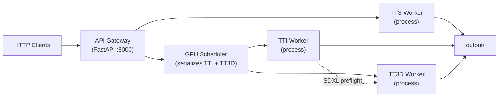

# ai-comms-platform

Headless **REST inference API** for multimodal generation on Windows. Any HTTP client can connect — scripts, game engines, creative tools, or automation pipelines.

| Engine | Model | Process |
|--------|-------|---------|
| **TTS** | SuperTonic 3 | isolated worker |
| **TTI** | SDXL-Base-1 | isolated worker |
| **TT3D** | [Hunyuan3D-2.1](https://huggingface.co/tencent/Hunyuan3D-2.1) shape-only | isolated worker |

Stack: FastAPI gateway, Diffusers, xFormers, Triton (Windows), PyTorch CUDA, reproducible installs via `uv.lock`.

## Architecture



**Gateway** — single FastAPI entry point, public REST surface.

**Workers** — each engine runs in its own Python subprocess with only its models loaded. The gateway communicates over a line-delimited JSON protocol on stdin/stdout.

**GPU scheduler** — serializes TTI and TT3D jobs so SDXL and Hunyuan never run on the GPU at the same time, avoiding OOM on a single card. TTS runs independently (lightweight, mostly CPU).

**TT3D is shape-only** — text → SDXL reference image → background removal → Hunyuan shape → GLB via trimesh. No PBR paint, no Blender, no `custom_rasterizer`, no textured GLB pipeline.

## Quick start (Windows)

Requires Python 3.12 and [uv](https://docs.astral.sh/uv/).

```sh
uv sync --extra gpu --extra tt3d
.\run_platform.bat
```

Default URL: `http://127.0.0.1:8000`

`run_platform.bat` runs `uv sync` from `pyproject.toml` + `uv.lock`, then starts the gateway. The gateway spawns three worker subprocesses and waits for them to preload engines when `ENGINES_PRELOAD_ON_STARTUP=true`.

Expected startup log:

```
Inference service running with isolated worker processes.
Inference worker pool is ready.
TTS engine preloaded.
TTI engine preloaded on cuda.
TT3D engine preloaded on cuda.
```

### Hunyuan3D vendor (TT3D, one-time)

```powershell
.\scripts\setup_hunyuan3d.ps1
```

Clones `vendor/Hunyuan3D-2.1` and runs `uv sync`. Only the **hy3dshape** subtree is used.

## Environment variables

| Variable | Default | Description |
|----------|---------|-------------|
| `WEB_HOST` | `127.0.0.1` | Gateway bind address |
| `WEB_PORT` | `8000` | Gateway bind port |
| `ENGINES_PRELOAD_ON_STARTUP` | `true` | Each worker loads its engine on start |
| `INFERENCE_IN_PROCESS` | `false` | `true` = in-process mode, no subprocesses (tests) |
| `TT3D_USE_INTERNAL_TTI` | `true` | Scheduler runs TTI worker before TT3D for SDXL reference |
| `HUNYUAN3D_ROOT` | `vendor/Hunyuan3D-2.1` | Hunyuan vendor path |
| `TT3D_MODEL_ID` | `tencent/Hunyuan3D-2.1` | Hugging Face model ID |

## Example client flow

```sh
# Liveness and runtime state
curl http://127.0.0.1:8000/health
curl http://127.0.0.1:8000/api/status

# Shared prompt for /test endpoints
curl -X POST http://127.0.0.1:8000/api/inference/prompt \
  -H "Content-Type: application/json" \
  -d '{"prompt": "a wooden chair on white background"}'

# Shape-only 3D (scheduler runs TTI preflight, then TT3D shape)
curl -X POST http://127.0.0.1:8000/api/tt3d/generate \
  -H "Content-Type: application/json" \
  -d '{"prompt": "a wooden chair on white background"}'

# Fetch latest artifact
curl -O http://127.0.0.1:8000/api/media/tt3d/latest
```

## API reference

### Core

| Method | Path | Description |
|--------|------|-------------|
| `GET` | `/health` | Liveness check |
| `GET` | `/api/status` | Engine states, `architecture`, GPU scheduler `pending_jobs` |

### Inference prompt

| Method | Path | Description |
|--------|------|-------------|
| `GET` | `/api/inference/prompt` | Read global prompt and defaults |
| `POST` | `/api/inference/prompt` | Set global prompt (`{"prompt": "..."}`) |

### TTS (SuperTonic 3)

| Method | Path | Description |
|--------|------|-------------|
| `GET` | `/api/tts/status` | Engine loaded state |
| `POST` | `/api/tts/engine/on` | Load engine in TTS worker |
| `POST` | `/api/tts/engine/off` | Unload engine |
| `POST` | `/api/tts/synthesize` | Synthesize WAV from `text` |
| `POST` | `/api/tts/test` | Quick render using global prompt |

### TTI (SDXL Base 1)

| Method | Path | Description |
|--------|------|-------------|
| `GET` | `/api/tti/status` | Engine loaded state |
| `POST` | `/api/tti/engine/on` | Load pipeline in TTI worker |
| `POST` | `/api/tti/engine/off` | Unload pipeline |
| `POST` | `/api/tti/generate` | Generate image from `prompt` |
| `POST` | `/api/tti/test` | Quick render using global prompt |

### TT3D (Hunyuan3D 2.1, shape-only)

| Method | Path | Description |
|--------|------|-------------|
| `GET` | `/api/tt3d/status` | Engine loaded state and prerequisites |
| `POST` | `/api/tt3d/engine/on` | Load shape pipeline in TT3D worker |
| `POST` | `/api/tt3d/engine/off` | Unload pipeline |
| `POST` | `/api/tt3d/generate` | SDXL preflight → shape → GLB |
| `POST` | `/api/tt3d/test` | Quick render using global prompt |

### Media

| Method | Path | Description |
|--------|------|-------------|
| `GET` | `/api/media/tts/latest` | Latest `output/tts_latest.wav` |
| `GET` | `/api/media/tti/latest` | Latest `output/tti_latest.png` |
| `GET` | `/api/media/tt3d/latest` | Latest `output/tt3d_latest.glb` |
| `GET` | `/api/media/tt3d/ref/latest` | Latest SDXL reference PNG |

## Package layout

```
src/comms_platform/
├── main.py                 # gateway entry (uvicorn)
├── config.py               # host/port and runtime flags
├── constants.py            # model defaults
├── services/
│   └── inference_service.py   # gateway facade over workers
├── scheduler/
│   └── gpu_scheduler.py       # serializes TTI + TT3D GPU jobs
├── workers/
│   ├── pool.py                # subprocess pool
│   ├── tts_worker.py          # TTS process entry
│   ├── tti_worker.py          # TTI process entry
│   └── tt3d_worker.py         # TT3D process entry
├── inference/              # engine implementations (tts, tti, tt3d)
└── web/                    # FastAPI routes and schemas
```

## Dependencies (`uv`)

Single source of truth: **`pyproject.toml`** + **`uv.lock`**. There is no separate `requirements.txt`.

```sh
uv sync --extra gpu --extra tt3d   # full install (TTS + TTI + TT3D)
uv sync --extra gpu                # TTS + TTI only
```

| Extra | Packages |
|-------|----------|
| `gpu` | xFormers 0.0.29.post2, triton-windows |
| `tt3d` | Hunyuan shape deps (trimesh, rembg, einops, torchdiffeq, …) |

PyTorch CUDA 12.4 wheels resolve via the `pytorch-cu124` index in `[tool.uv.sources]`. Resolution is limited to Windows + Python 3.12 via `[tool.uv].environments`.

## TT3D shape-only flow


Outputs under `output/`:

- `tt3d_latest.glb` — latest shape mesh
- `tt3d_ref_latest.png` — SDXL reference used for conditioning
- `tti_latest.png`, `tts_latest.wav` — latest TTI/TTS artifacts

## Tests

```sh
uv run pytest -q tests/test_api_health.py tests/test_api_inference.py tests/test_inference_prompts.py
```

Tests use `INFERENCE_IN_PROCESS=true` (via `TestConfig`) so no worker subprocesses are spawned.

## License

[MIT License](./LICENSE)
